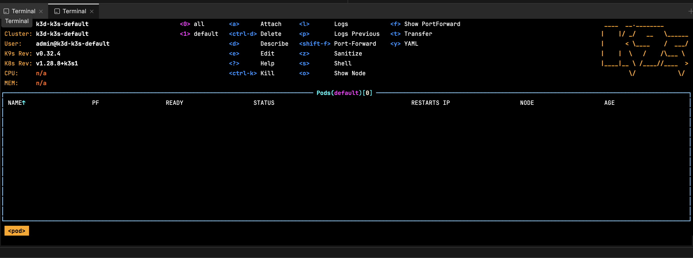

# Cluster Creation

## Create a cluster with k3d

```bash
k3d cluster create --api-port 6550 -p '9080:80@loadbalancer' -p '9443:443@loadbalancer' --agents 2 --k3s-arg '--disable=traefik@server:*'

```

... Wait for k3d to boot up


