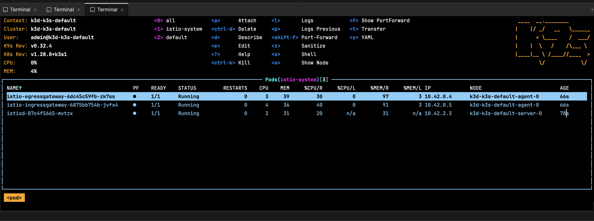
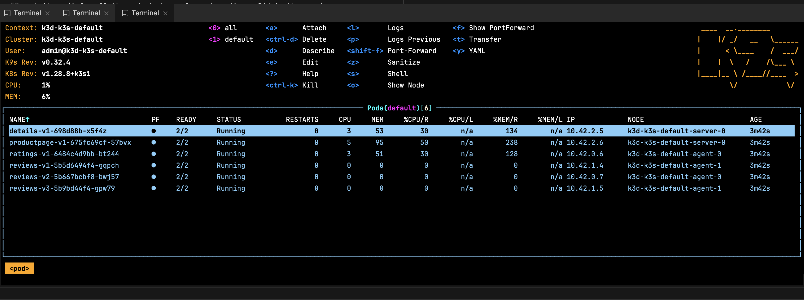

# ISTIO Install

## Architecture


## Reference

[Getting Started](https://istio.io/latest/docs/setup/getting-started/)

## CLI download link

https://github.com/istio/istio/releases/tag/1.21.2

Add it to your $PATH

## Validate

```bash
➜  istioctl version
no ready Istio pods in "istio-system"
1.21.1
```

## Install the "demo" profile

```bash
➜ istioctl install --set profile=demo -y

✔ Istio core installed
✔ Istiod installed
✔ Egress gateways installed      
✔ Ingress gateways installed
✔ Installation complete
Made this installation the default for injection and validation.
```




## Enable sidecar injection

```bash
➜ kubectl label namespace default istio-injection=enabled
```

## Deploy a quick demo app

[Reference](https://istio.io/latest/docs/examples/bookinfo/)


```bash
kubectl apply -f https://raw.githubusercontent.com/istio/istio/release-1.21/samples/bookinfo/platform/kube/bookinfo.yaml
kubectl get services
kubectl get pods -w
```

Let's wait for all the pods to be up & running, then validate the services

```bash
kubectl exec "$(kubectl get pod -l app=ratings -o jsonpath='{.items[0].metadata.name}')" -c ratings -- curl -sS productpage:9080/productpage | grep -o "<title>.*</title>"
```


