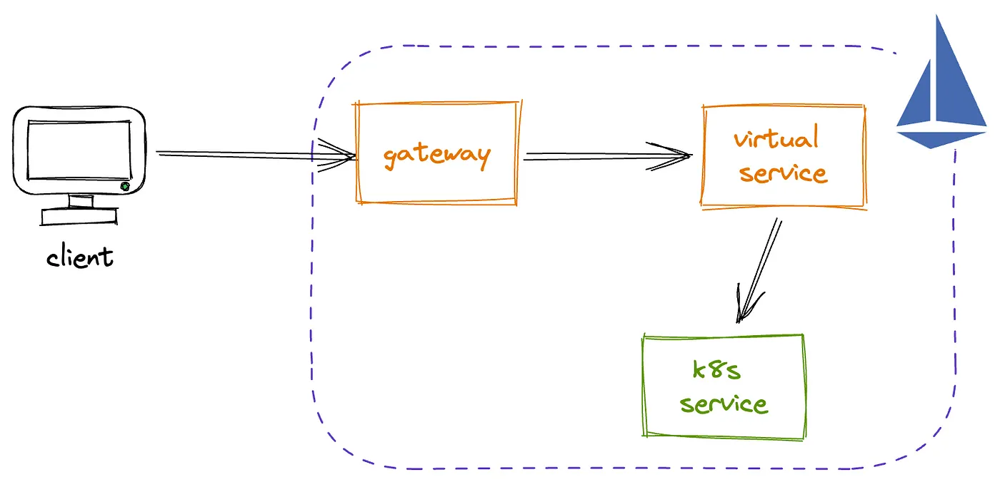

# Gateways and Services 



## Gateways

[Refeference](https://istio.io/latest/docs/reference/config/networking/gateway/)

- The entry point into istio for the outside world
- Basically a binding between an istio ingress gateway
and a set of port/protocols

```yaml
{{#include bookinfo-gateway.yaml}}
```

- Similar to the modern kube `Gateway` resource

```yaml
{{#include vanilla/gateway.yaml}}
```

## Virtual services

[Refeference](https://istio.io/latest/docs/reference/config/networking/virtual-service/)

- Directors for traffic to kube services

```yaml
{{#include bookinfo-virtual-service.yaml}}
```

Like kube `HTTPRoute`, but they were there well before `HTTPRoute`

```yaml
{{#include vanilla/http-route.yaml}}
```

## Let's expose our app

```bash
kubectl apply -f bookinfo-gateway.yaml
kubectl apply -f booking-virtual-service.yaml

```

[Link to the website](http://localhost:9080/productpage)

## Sidecar injection


